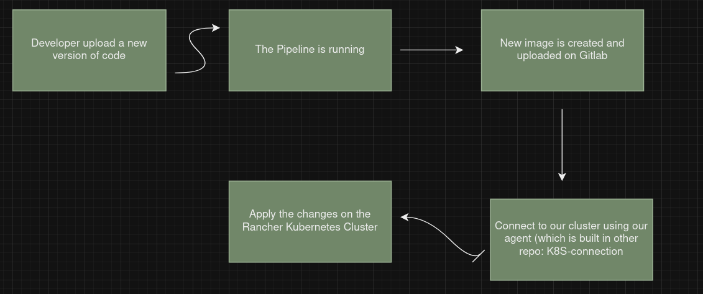
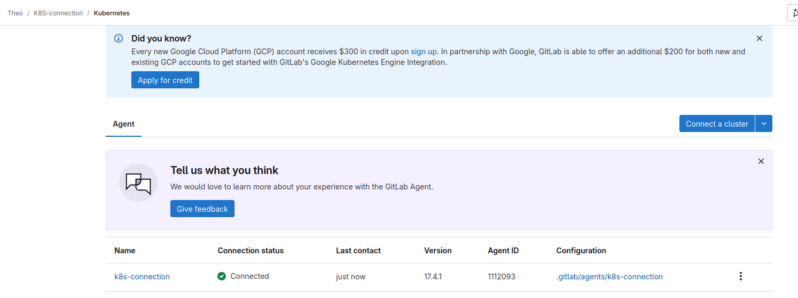
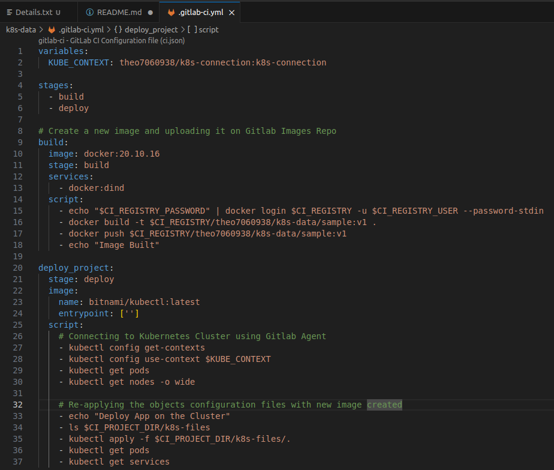
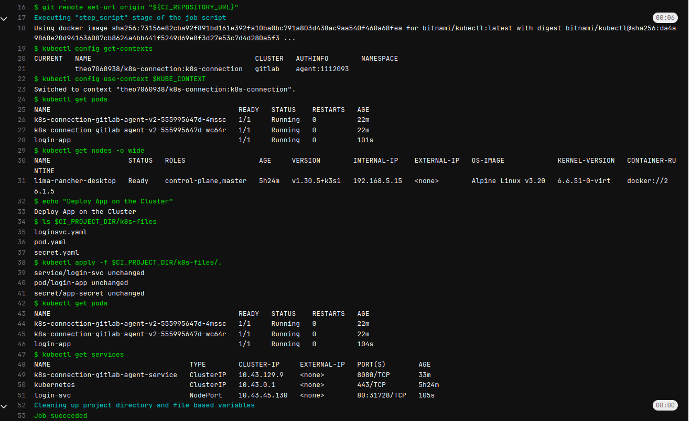
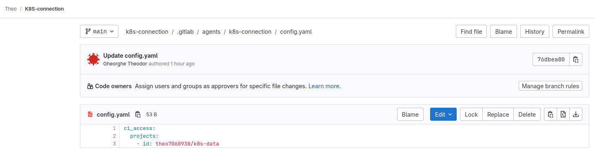

# Local Kubernetes Deployment with an Automated CI/CD Pipeline

This project implements a GitLab CI/CD pipeline for automatic application deployments on a local Kubernetes cluster, using the GitLab Agent to simplify updates and management, with the application running on an Nginx server.




## Features

- **GitLab CI/CD Integration**: Automates the build and deployment process for applications.
- **Local Kubernetes Deployment**: Deploys applications to a local Kubernetes cluster managed by Rancher.
- **GitLab Agent Connection**: Uses the GitLab Agent to establish a secure link between GitLab and the local cluster.
- **Nginx Server**: Hosts the application on an Nginx server for reliable performance and easy management.
- **Simplified Management**: Streamlines the process of updating and managing applications in the local Kubernetes environment.

## The ideea ?

When a developer uploads a new version of the code to the main branch, a new Docker image is built and uploaded to GitLab, and the updated cluster configuration files are applied.

## Steps

- **Create a local Kubernetes cluster** with **Rancher**
- **Create the Agent** for connecting out cluster with Gitlab Pipeline
    


- **Set Up GitLab CI/CD Pipeline**: Create a .gitlab-ci.yml file in your repository to define the CI/CD pipeline for building and deploying your application.



- **Build Docker Image**: Configure the pipeline to automatically build a new Docker image whenever changes are pushed to the main branch.

- **Upload Docker Image to GitLab**: Ensure that the built Docker image is uploaded to the GitLab Container Registry for easy access.

- **Apply Cluster Configuration Files**: After a new image is uploaded, automatically apply the updated Kubernetes configuration files to deploy the new version of the application.

- **Verify Deployment**: Check the status of your application and ensure that it is running correctly in the local Kubernetes cluster.



## How the agent is created ?

 - Create a new repo named **K8S-connections**
 - Run the code
```bash
  helm repo add gitlab https://charts.gitlab.io
  helm repo update
  helm upgrade --install k8s-connection gitlab/gitlab-agent \
    --namespace gitlab-agent-k8s-connection \
    --create-namespace \
    --set config.token=**your-access-code** \
    --set config.kasAddress=wss://kas.gitlab.com
```

- Add the permision:




